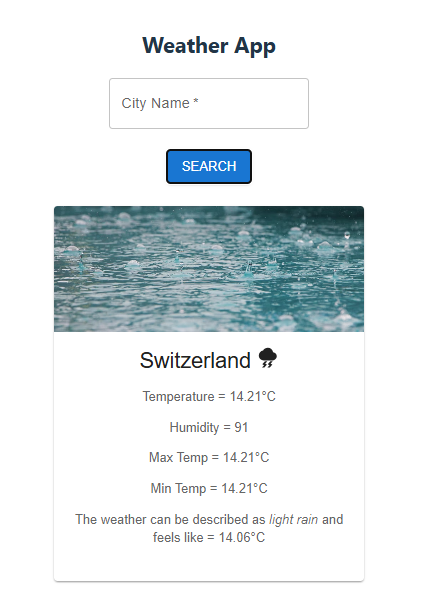
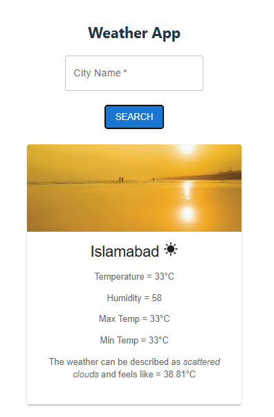
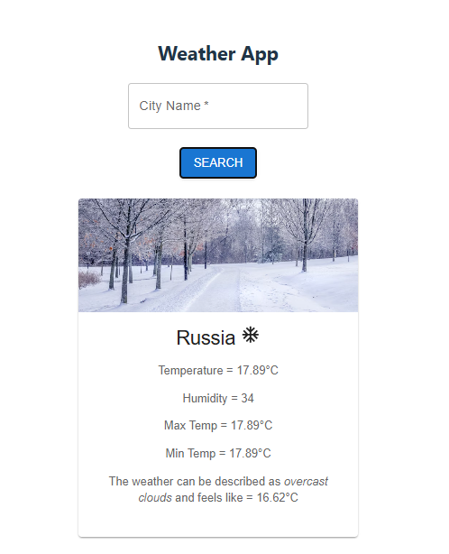

# A Weather App

## Description

A simple yet functional weather app created with React and Material UI that lets users check current weather conditions for any city in real-time. It demonstrates API data fetching, state management, and responsive design principles in a practical, beginner-friendly project.

## Getting Started on Your Local Server

Follow these steps to run the project locally:

1. **Clone the repository:**

   ```bash
   git clone https://github.com/HinaMuzaffar/Weather-App.git
   cd weather-app

   ```

2. **Install Dependencies:**
   ```bash
    npm install
   ```
3. **Add Environment Variables:**
   - Create a .env file in the root of your project and add your weather API key:
     ```ini
     VITE_API_KEY= your_api_key_here
     ```
4. **Run the Development Server:**
   ```bash
   npm run dev
   ```

- Open http://localhost:5173 with your browser to see the result.

## 📸 Screenshots

## 📸 Screenshots

<p align="center">
  
  
  
</p>
